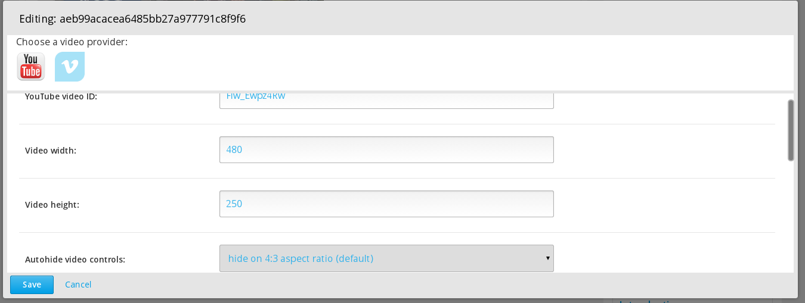
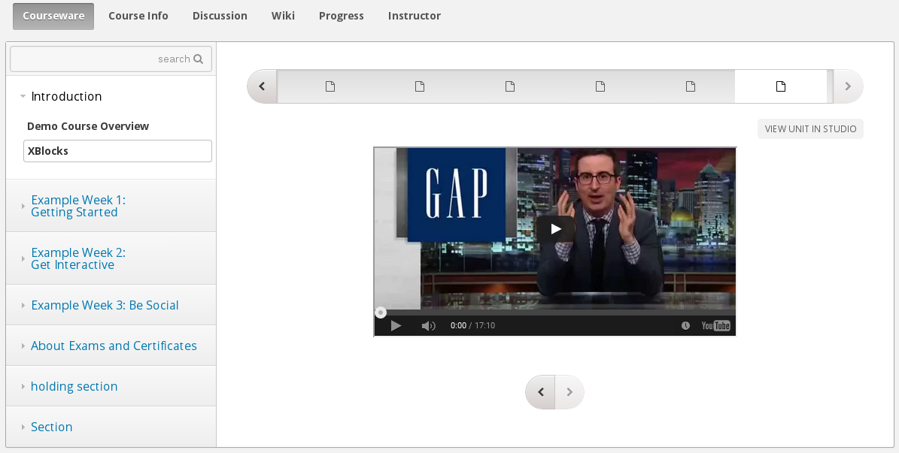

# EmbedVideos XBlock
An XBlock that allows course creators to add videos with various parameters from various providers.

The XBlock is added like this:

```html
<embedvideos vimeo_id="52422837"/>
<embedvideos youtube_id="U6l9NdAJwRk"/>
```

The XBlock in Studio looks like this:


Output looks like this:



TODO:
- preserve selected values on edit
- include color picker for Vimeo player color parameter
- add DailyMotion provider

---
contact: vkaracic@extensionengine.com
